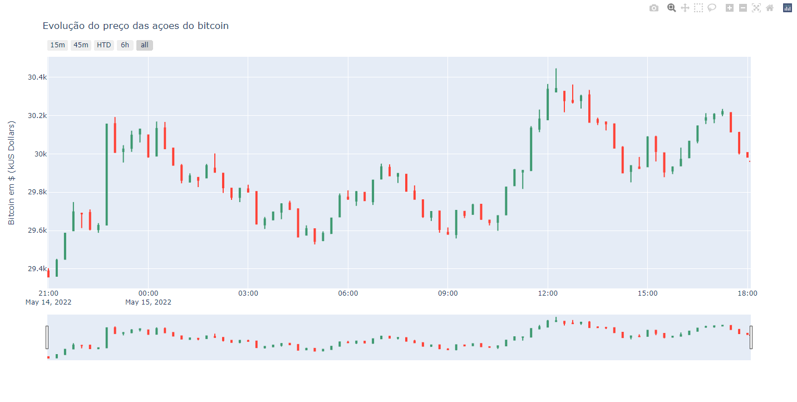

### 	:electric_plug: 1- Functionalities
**1 -** Procurar Evoluçao do preço das acoes do bitcoin <br>

### :keyboard: 2 - Install Requeriments
```cmd
  pip install yfinance
  pip install plotly
```
### :cd: 3 - Start localhost
```cmd
 python getCriptoData.py
```
## Bibliotecas utilizadas:
Pandas
NumPy
Yfinance
Plotly 

# bibliotecas:
numpy:
- Supports processing of large, multi-dimensional arrays and matrices, along with a large collection of high-level math functions

pandas:
- Data manipulation and analysis

yfinance:
- Access financial data available on Yahoo Finance

plotly.graph_objs:
- Creates interactive graphics

___________________________________________________________________________________________________________
References:

Dashborad 
-->  https://plotly.com/

bitcoin price (to compare with result)
--> https://finance.yahoo.com/quote/BTC-USD?p=BTC-USD&.tsrc=fin-srch 

